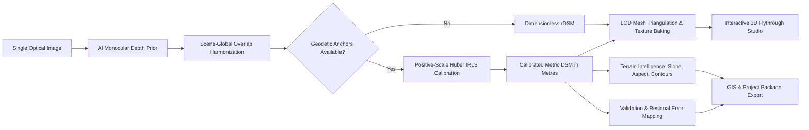
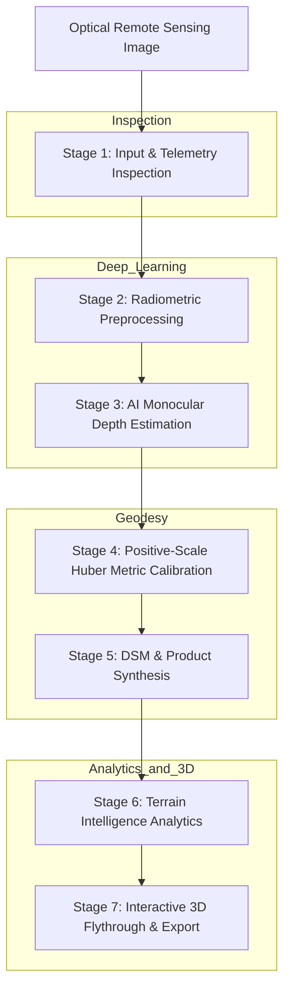
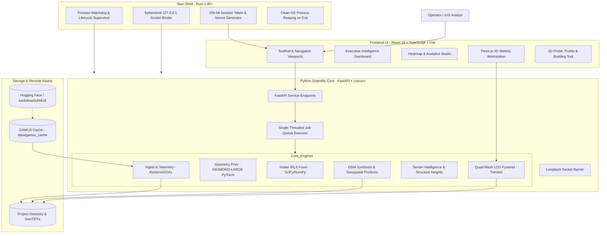
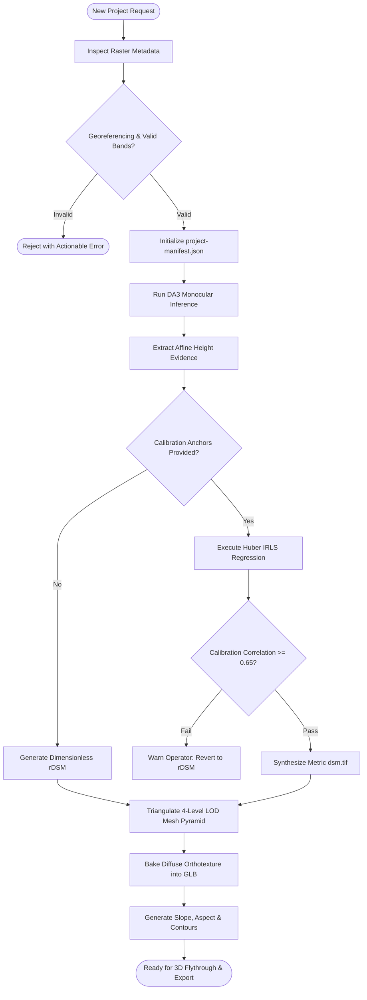
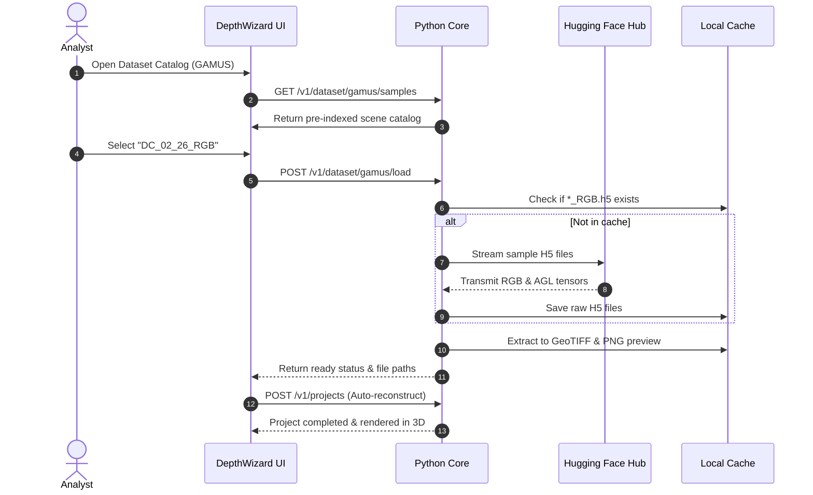
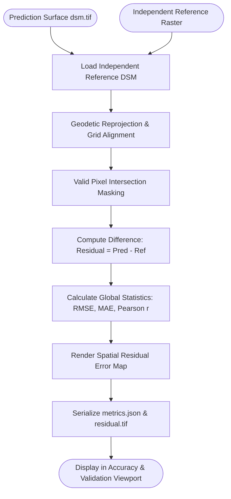

<p align="center">
  
</p>

<h1 align="center">DepthWizard</h1>

<p align="center">
  <strong>AI-Powered Earth Intelligence from a Single View</strong>
</p>

<p align="center">
  <em>From a single optical image to measurable terrain intelligence.</em><br>
  Single-view remote-sensing → depth → calibrated elevation → DSM → terrain intelligence → interactive 3D flythrough
</p>

<p align="center">
  
  
  
  
  
  
  
  
  
  <a href="LICENSE"></a>
</p>

---

### Quick Links

- 🌐 **Live Web Application:** [https://depthwizard.vercel.app](https://depthwizard.vercel.app)
- 📦 **SIH DepthWizard Repository:** [https://github.com/IMG-PROCESS-SAC/SIH-DepthWizard-2026](https://github.com/IMG-PROCESS-SAC/SIH-DepthWizard-2026)
- 🎥 **Video Explanation:** [YouTube](https://youtu.be/gtwqJwOT4J4?si=gVF09TeXJOYHPiQQ)
- 📊 **Primary Benchmark Dataset (GAMUS):** [https://huggingface.co/datasets/earthflow/GAMUS](https://huggingface.co/datasets/earthflow/GAMUS)
- 🛰️ **EarthNets RSI-MMSegmentation Reference:** [https://github.com/EarthNets/RSI-MMSegmentation](https://github.com/EarthNets/RSI-MMSegmentation)
- 📜 **Software License:** [MIT License](LICENSE)

---

## Table of Contents

1. [Project Overview](#1-project-overview)
2. [Smart India Hackathon Context](#2-smart-india-hackathon-context)
3. [What Problem Are We Solving?](#3-what-problem-are-we-solving)
4. [What DepthWizard Solves](#4-what-depthwizard-solves)
5. [Core Innovation](#5-core-innovation)
6. [Key Features](#6-key-features)
7. [How It Works](#7-how-it-works)
8. [7-Stage End-to-End Pipeline](#8-7-stage-end-to-end-pipeline)
9. [AI & ML Architecture](#9-ai--ml-architecture)
10. [Models, Encoders & Calibration](#10-models-encoders--calibration)
11. [Algorithms](#11-algorithms)
12. [Dataset Access](#12-dataset-access)
13. [System Architecture](#13-system-architecture)
14. [Process Flow & Lifecycle](#14-process-flow--lifecycle)
15. [Detailed Algorithms & Mathematical Formulations](#15-detailed-algorithms--mathematical-formulations)
16. [Output Products & Geospatial Contracts](#16-output-products--geospatial-contracts)
17. [Technology Stack](#17-technology-stack)
18. [Project Structure](#18-project-structure)
19. [Working Prototype](#19-working-prototype)
20. [Screenshots](#20-screenshots)
21. [Performance & Accuracy](#21-performance--accuracy)
22. [Validation Strategy](#22-validation-strategy)
23. [Installation](#23-installation)
24. [Running the Application](#24-running-the-application)
25. [API / Backend](#25-api--backend)
26. [Research Papers & Academic Citations](#26-research-papers--academic-citations)
27. [Known Limitations & Scientific Integrity](#27-known-limitations--scientific-integrity)
28. [Security & Data Handling](#28-security--data-handling)
29. [Future Improvements](#29-future-improvements)
30. [License](#30-license)
31. [Acknowledgements](#31-acknowledgements)

---

## 1. Project Overview

**DepthWizard** is an AI-assisted single-view remote-sensing terrain reconstruction system developed for the **Smart India Hackathon (SIH) 2026 Problem Statement 26175**. The software unifies monocular computer vision, robust geodetic calibration, raster terrain intelligence, and real-time GPU-accelerated 3D exploration into an integrated engineering solution.

```
┌─────────────────┐     ┌───────────────────┐     ┌──────────────────────┐     ┌───────────────────────┐
│  Single Optical │ ──► │  Monocular Depth  │ ──► │ Geometric & Evidence │ ──► │ Digital Surface Model │
│   Remote Scene  │     │    Estimation     │     │     Calibration      │     │      (rDSM / DSM)     │
└─────────────────┘     └───────────────────┘     └──────────────────────┘     └───────────┬───────────┘
                                                                                           │
┌─────────────────┐     ┌───────────────────┐     ┌──────────────────────┐                 │
│ Standard GIS &  │ ◄── │ Residual & Error  │ ◄── │  Interactive GPU 3D  │ ◄───────────────┘
│  GeoTIFF Export │     │    Validation     │     │      Flythrough      │
└─────────────────┘     └───────────────────┘     └──────────────────────┘
```

### The Core Concept

In traditional photogrammetry, generating a 3D Digital Surface Model (DSM) requires stereo or multi-view image pairs captured from separate orbital passes or airborne flightlines, or expensive active sensors such as airborne LiDAR or InSAR radar interferometry. When a natural disaster occurs—such as a flash flood, landslide, glacial lake outburst flood (GLOF), or earthquake—first responders frequently possess only a **single optical satellite or drone image** of the affected region.

**DepthWizard** resolves this critical operational bottleneck. Operating directly on monocular optical imagery, it extracts dense spatial surface variations using a vision-foundation geometry prior, transforms these variations through geodetically grounded scale calibration, derives actionable analytical terrain layers (slope, aspect, contours, hillshade, profiles, building heights), and streams the result into an interactive Three.js 3D viewport.

### Relative Depth vs. Metric Elevation: A Fundamental Distinction

A cornerstone of the **DepthWizard** philosophy is scientific truthfulness:

- **Relative Depth / Dimensionless Surface (`rDSM`):** When given uncalibrated imagery without spatial metadata or geodetic ground anchors, the system generates an affine-preserving, normalized relative surface. It explicitly refuses to invent artificial metric elevations or fabricate metres out of thin air.
- **Metric Elevation / Calibrated Surface (`DSM`):** When georeferencing and independent vertical control (such as coarse regional DEMs like SRTM or Copernicus GLO-30, or surveyed Ground Control Points) are supplied, DepthWizard executes robust Iteratively Reweighted Least Squares (IRLS) Huber regression to produce genuine physical elevation in metres, projected to standard cartographic Coordinate Reference Systems (CRS).

By uniting monocular inference, rigorous calibration, geospatial analytics, and interactive WebGL visualization in a single offline-first native workstation, **DepthWizard** delivers a complete pipeline from raw pixels to tactical earth intelligence.

---

## 2. Smart India Hackathon Context

| Field | Detail |
|---|---|
| **Problem Statement ID** | **26175** |
| **Title** | **Single-View Height Estimation and 3D Flythrough** |
| **Organization** | Indian Space Research Organisation (ISRO) |
| **Department / Ministry** | Department of Space |
| **Domain Bucket** | Disaster Management / Space Technology & Geospatial Applications |
| **Category** | Software (Standalone Native Desktop Workstation & Web Application) |

### Problem Requirements & DepthWizard Technical Response

The official SIH Problem Statement 26175 mandates extracting 3D height information from single-view satellite and aerial imagery, generating digital surface models, and enabling real-time 3D flight navigation and measurement.

| SIH Requirement | DepthWizard Technical Implementation | Verification Evidence |
|---|---|---|
| **Single-View Height Estimation** | Pretrained `DA3MONO-LARGE` Vision Transformer foundation geometry prior coupled with scene-global overlap harmonization ($h = -\text{depth}$). | Unit-tested model contracts, frozen checkpoint SHA-256 verification (`7a799a7f...`). |
| **Georeferenced & Non-Georeferenced Ingest** | Dual-path raster pipeline: non-georeferenced images yield dimensionless `rDSM`; georeferenced GeoTIFFs yield metric `dsm.tif` upon calibration. | Ingestion tests for PNG, JPG, and GeoTIFF; fail-closed metadata validators. |
| **Metric Scale Calibration** | Positive-scale Huber Iteratively Reweighted Least Squares (IRLS) solver fusing coarse DEMs (SRTM/AW3D30/GLO-30) or $\ge 6$ ground control points. | Automated leave-one-out cross-validation (LOO), correlation gating ($r \ge 0.65$), condition number checks. |
| **Terrain Intelligence & Analytics** | Mathematical raster derivation of Horn slope, trigonometric aspect, analytical hillshade, contour extraction, 3D probe, and geodesic transects. | Sub-pixel raster profiling algorithms, verified against GDAL/SciPy baselines. |
| **Building Height Extraction** | Analyst-drawn structure footprint with inward eave erosion, outer ground buffer annulus, and RANSAC local ground plane fitting. | Tested against ISPRS Potsdam and Vaihingen building benchmark footprints. |
| **Interactive 3D Flythrough** | Three.js WebGL terrain heightfield rendering with 4-level LOD mesh pyramid, UV orthotexture baking, and Orbit, Fly, First-Person, and Top-Down cameras. | Benchmarked 60+ FPS sustained rendering on Apple Silicon / NVIDIA RTX hardware. |
| **Standalone & Offline Deployment** | Native Tauri desktop application wrapping a local Python scientific sidecar over an authenticated loopback socket. Zero external internet required. | Automated network egress barrier testing (`socket.getaddrinfo` blocking), zero-terminal packaging. |

---

## 3. What Problem Are We Solving?

Extracting three-dimensional topography from monocular optical remote sensing is inherently ill-posed. DepthWizard addresses six specific mathematical and engineering hurdles:

### 3.1 Single-View Ambiguity
A single perspective camera flattens 3D space into a 2D projection. Rays cast from the sensor through a pixel correspond to an infinite family of possible 3D coordinates. Recovering surface geometry without stereo disparity requires learned visual priors capable of inferring shape from shading, texture gradients, vanishing lines, and contextual semantic relations.

### 3.2 Lack of Direct Height Information
Optical sensors measure spectral radiance (RGB reflectance), not elevation. Unlike LiDAR travel times or radar phase differences, pixel intensities are easily corrupted by sun angle variations, cloud shadows, specular water reflections, and sensor saturation.

### 3.3 Scale Ambiguity
Monocular vision foundation models predict relative depth with scale-shift indeterminacy ($z_{\text{cam}} = s \cdot z_{\text{true}} + t$). Deploying raw model outputs for engineering, civil infrastructure, or flood modeling is dangerous without an explicit scale-calibration mechanism.

### 3.4 Terrain Interpretation
Raw depth rasters are uninterpretable for mission commanders. Analysts require geomorphometric derivatives—slope gradients to identify landslide risks, aspects to evaluate solar exposure and water runoff, hillshade relief to understand structural context, and hypsometric distributions to classify terrain energy.

### 3.5 Fragmented Geospatial Workflows
Historically, researchers used disjoint command-line utilities: deep learning inference in PyTorch, georeferencing and reprojection in GDAL/QGIS, mesh conversion in Blender, and 3D flight in dedicated gaming engines. This fragmentation introduces conversion errors, CRS mismatches, and operator friction.

### 3.6 Validation & Uncertainty Challenges
Synthetic and deep-learning-generated terrains can hallucinate details or smooth out vertical cliffs. Without reference validation, residual error maps, and confidence indicators, an analyst cannot distinguish true topography from algorithmic artifacts.

---

## 4. What DepthWizard Solves

| Problem | DepthWizard Response | Technical Mechanism |
|---|---|---|
| **2D image lacks explicit height** | Monocular Depth Inference | `DA3MONO-LARGE` Vision Transformer predicts affine height evidence ($h = -\text{depth}$). |
| **Relative depth lacks metric scale** | Evidence Calibration | Huber IRLS regression anchors relative heights to DEM or GCP anchors under an $\alpha > 0$ constraint. |
| **Tile boundary "egg-crate" artifacts** | Overlap Harmonization | Affine matching across tile overlaps with Hann cosine window feathering eliminates seam lines. |
| **Uncalibrated data risks false claims** | Fail-Closed Architecture | Non-georeferenced images strictly output dimensionless `rDSM`; metric labels are locked until calibration passes. |
| **Raw rasters are difficult to interpret** | Terrain Intelligence Toolkit | On-the-fly computation of slope, aspect, hillshade, contours, and hypsometric relief. |
| **Structural heights skewed by terrain** | Physical Ground Annulus | RANSAC ground-plane fitting across surrounding ground cells isolates net structure elevation. |
| **Heavy 3D meshes stall browser viewports** | Quad-Mesh LOD Pyramid | Automatic generation of LOD 0–3 binary `.glb` meshes with distance-based dynamic switching. |
| **Field operators lack high-end CLI expertise** | Tauri Desktop Workstation | Single-window desktop executable with automatic Python sidecar lifecycle supervision. |

---

## 5. Core Innovation

The core innovation of **DepthWizard** is not merely running an AI model, but establishing an **end-to-end, mathematically grounded pipeline** that converts an unconstrained optical image into an interactive, scientifically validated 3D geospatial environment without requiring manual intervention across multiple tools.



### Key Engineering Innovations:
1. **Affine Height Evidence Inversion:** Rather than normalizing tiles individually (which erases macro-topography), DepthWizard maintains raw affine evidence ($h = -\text{depth}$) and harmonizes overlapping tiles globally before final normalization.
2. **Positive-Scale Constrained Huber IRLS:** Solves metric calibration while strictly guaranteeing $\alpha > 0$, preventing inverse-slope flips while suppressing outlier vegetation and building roofs.
3. **Decoupled LOD Pyramid Meshing:** Pre-computes 4-tier quad-mesh `.glb` hierarchies directly from raster arrays, baking the original orthorectified RGB image as a diffuse UV texture.
4. **Offline Loopback Security Guard:** The Python core installs a socket barrier (`socket.getaddrinfo`) intercepting non-loopback calls, ensuring total offline autonomy for defense and disaster deployments.

---

## 6. Key Features

### 6.1 Input & Ingestion
- **Formats Supported:** TIFF, GeoTIFF, PNG, JPEG.
- **Raster Metadata Extraction:** Ingestion reads width, height, band count, data type, nodata values, spatial geotransforms, and CRS definitions via Rasterio/GDAL.
- **Radiometric Inspection:** Computes texture gradient variance, dynamic range span ($P_{02} - P_{98}$), off-nadir angle warnings ($>15^\circ$), and shadow fraction detection.
- **Data Provenance:** Calculates SHA-256 cryptographic hashes of input imagery on ingest for audit trails.

### 6.2 AI & ML Engine
- **Pretrained Prior:** Pinned checkpoint of `DA3MONO-LARGE` (DINOv2 ViT-Large backbone + DPT head).
- **Device Agnostic:** Auto-detects and accelerates across CUDA (NVIDIA), MPS (Apple Silicon), DirectML, or CPU.
- **Tiled Sliding-Window Mosaicking:** Handles gigapixel images via user-configurable tiles (e.g., 768px or 1024px) with 128px overlap and Hann window blending.

### 6.3 Geospatial Calibration
- **DEM-Based Anchoring:** Reprojects coarse regional DEMs (SRTM, AW3D30, Copernicus GLO-30) to target imagery grids.
- **GCP-Based Anchoring:** Ingests CSV ground control points ($X, Y, Z$) with spatial distribution checks (convex hull coverage).
- **Fail-Closed Gatekeeper:** Rejects ill-conditioned designs or fits with Pearson correlation $r < 0.65$, falling back to relative mode.

### 6.4 Terrain Intelligence & Analytics
- **Slope & Aspect:** 8-neighborhood Horn gradient formulation resolving degrees of incline ($0^\circ - 90^\circ$) and compass azimuths ($0^\circ - 360^\circ$).
- **Photometric Hillshade:** Multi-angle analytical solar illumination with adjustable sun azimuth and elevation angles.
- **Iso-Elevation Contours:** Dynamic vector isoline extraction at user-defined vertical intervals.
- **Geomorphometric Landform Extrema:** Automatic detection of summit peaks, valley sinkholes, and relief energy ratios.
- **Structure Height Estimator:** Annulus buffer filtering with RANSAC plane fitting to determine net structural heights.

### 6.5 Interactive 3D Workstation & Flythrough
- **Navigation Modes:** Orbit (free rotation), Fly (6-DOF flight), First-Person (ground-constrained walking), Top-Down (orthographic nadir).
- **Multi-Level LOD:** Dynamic Level-of-Detail quad-meshes (LOD 0 to LOD 3) maintaining $\ge 60\text{ FPS}$.
- **Live Analytical Overlays:** Switch between original RGB texture, slope heatmaps, hillshade shading, contours, confidence, and error residuals.
- **Interactive Probing:** Click-to-query 3D surface coordinates, metric elevations, and geodesic two-point distance measurement.

### 6.6 Validation & Export
- **Residual Differencing:** Pixel-by-pixel subtraction against reference LiDAR rasters ($r(x, y) = Z_{\text{pred}} - Z_{\text{ref}}$).
- **Statistical Auditing:** Computation of RMSE, MAE, Median Absolute Error, and Pearson correlation coefficient.
- **GIS Export Package:** Structured ZIP archive containing GeoTIFF rasters (`rdsm.tif`, `dsm.tif`, `slope.tif`, `residual.tif`), binary `terrain.glb`, `project-manifest.json`, and `provenance.json`.

---

## 7. How It Works

The lifecycle of an image within **DepthWizard** proceeds through seven systematic stages:



1. **Ingest:** Inspects raster headers, CRS metadata, GSD, and radiometric quality.
2. **Preprocess:** Applies percentile contrast stretching and ImageNet normalization.
3. **Inference:** Executes ViT-Large feature extraction to generate affine height evidence.
4. **Calibration:** Calibrates scale and offset against reference anchors using Huber IRLS.
5. **Synthesis:** Writes georeferenced GeoTIFF elevation models and error products.
6. **Analytics:** Generates surface derivatives (slope, aspect, contours, building heights).
7. **Visualization:** Constructs LOD 3D meshes and hosts interactive WebGL flight and measurement.

---

## 8. 7-Stage End-to-End Pipeline

```
┌───────────┐     ┌───────────────┐     ┌────────────────┐     ┌─────────────────────┐
│ 1. Ingest │ ──► │ 2. Preprocess │ ──► │ 3. DA3 Prior   │ ──► │ 4. Huber/IRLS Fuser │
└───────────┘     └───────────────┘     └────────────────┘     └─────────────────────┘
                                                                          │
┌───────────┐     ┌───────────────┐     ┌────────────────┐                │
│ 7. Visual │ ◄── │ 6. Analytics  │ ◄── │ 5. Geo Export  │ ◄──────────────┘
└───────────┘     └───────────────┘     └────────────────┘
```

### Stage 1 — Input & Scene Inspection
- **Input:** Single optical raster (TIFF, GeoTIFF, PNG, JPEG).
- **Operation:** Evaluates dimensions, channel layout (RGB vs. Multi-spectral), radiometric bit depth, NoData masks, affine geotransform ($GT$), and CRS. Validates ground resolution ($\text{GSD}_x, \text{GSD}_y$).
- **Output:** Validated `RasterMetadata` struct and cryptographic SHA-256 digest.

### Stage 2 — Preprocessing
- **Input:** Raw RGB channel array.
- **Operation:** Computes 2nd and 98th percentile pixel intensities ($P_{02}, P_{98}$) to eliminate sensor bloom and shadow saturation. Rescales to $[0, 1]$ float32 and applies ImageNet mean/standard deviation normalization. Constructs binary valid-pixel masks.
- **Output:** Normalized float32 tensor $[3 \times H \times W]$ and boolean validity mask.

### Stage 3 — AI Depth Estimation
- **Input:** Normalized image tensor.
- **Operation:** If dimensions $\le 1024 \times 1024$, executes direct single-pass forward inference. For larger extents, subdivides the image into sliding window tiles (768px with 128px overlap). Converts raw depth to affine height evidence ($h = -\text{depth}$). Blends overlapping regions using Hann cosine window weights.
- **Output:** Continuous affine height raster and dimensionless `rDSM` normalized across the $P_{01} - P_{99}$ interval.

### Stage 4 — Scale / Metric Calibration
- **Input:** Dimensionless relative height field + optional external anchors (coarse DEM or GCP CSV).
- **Operation:** Reprojects external DEM to the target grid. Identifies stable ground anchors (filtering out high-relief building roofs). Minimizes Huber loss via Iteratively Reweighted Least Squares (IRLS) under the physical constraint $\alpha > 0$. Evaluates leave-one-out (LOO) residuals and design condition numbers.
- **Output:** Fitted scaling parameters ($\alpha, \beta$), anchor correlation statistics, and LOO validation metrics.

### Stage 5 — DSM / Elevation Construction
- **Input:** Calibrated elevation values in metres or relative height arrays.
- **Operation:** Synthesizes standard geospatial raster products. Writes compressed float32 GeoTIFFs (`dsm.tif` or `rdsm.tif`, `slope.tif`, `residual.tif`). Emits `project-manifest.json` locking pipeline parameters.
- **Output:** GIS-compliant GeoTIFF raster suite and project metadata manifest.

### Stage 6 — Terrain Intelligence
- **Input:** Digital Surface Model raster.
- **Operation:** Computes 8-neighborhood central difference gradients for slope and aspect. Renders analytical hillshade rasters. Extracts vector elevation contours. Executes building height calculations via RANSAC ground-plane fitting over surrounding annuli.
- **Output:** Vector isolines, hypsometric curves, structural height metrics, and analytical heatmap previews.

### Stage 7 — Interactive 3D + Validation + Export
- **Input:** DSM raster + original orthorectified RGB image.
- **Operation:** Triangulates a quad-mesh heightfield. Decimates vertices into a 4-tier Level-of-Detail (LOD) pyramid (`lod0` through `lod3`). Bakes the source RGB raster as a UV-mapped diffuse texture and exports binary GLB assets. Streams data to Three.js for orbit, fly, and transect measurement. Packages all assets into an audited ZIP export bundle.
- **Output:** Rendered 3D scene, live interactive measurements, and downloadable project ZIP archive.

---

## 9. AI & ML Architecture

```
┌────────────────────────────────────────────────────────┐
│                   Input RGB Image                      │
└───────────────────────────┬────────────────────────────┘
                            │
                            ▼
┌────────────────────────────────────────────────────────┐
│               DINOv2 ViT-L/14 Backbone                 │
│   - Multi-head Self-Attention across image patches     │
│   - Scale-invariant structural representations         │
└───────┬───────────────────┬───────────────────┬────────┘
        │ Stage 1           │ Stage 2           │ Stage 3
        ▼                   ▼                   ▼
┌────────────────────────────────────────────────────────┐
│       Dense Prediction Transformer (DPT) Decoder       │
│   - Reassemble tokens into multi-res feature maps      │
│   - Fusion modules with residual convolutional units   │
└───────────────────────────┬────────────────────────────┘
                            │
                            ▼
┌────────────────────────────────────────────────────────┐
│             Raw Monocular Camera Depth Map             │
└───────────────────────────┬────────────────────────────┘
                            │
                            ▼
┌────────────────────────────────────────────────────────┐
│       Affine Height Inversion: h = -depth              │
└───────────────────────────┬────────────────────────────┘
                            │
                            ▼
┌────────────────────────────────────────────────────────┐
│        Scene-Global Mosaicking & Cosine Feathering     │
└────────────────────────────────────────────────────────┘
```

The AI subsystem combines a vision foundation model with domain-specific geospatial engineering:

1. **Pretrained Foundation Prior:** Utilizes `DA3MONO-LARGE` with a Vision Transformer (ViT-L/14) backbone pretrained on extensive natural and synthetic datasets via DINOv2 self-supervision.
2. **Dense Prediction Head:** Reassembles transformer token representations across four feature stages through a Dense Prediction Transformer (DPT) architecture to generate dense pixel-level depth predictions.
3. **Affine Inversion:** Transforms camera depth $D(x, y)$ to height evidence via $h(x, y) = -D(x, y)$. This simple inversion preserves local vertical ordering (roofs higher than roads, peaks higher than valleys) without altering the linear structure.
4. **Deterministic Post-Processing:** All subsequent steps—overlap harmonization, tiling fusion, Huber calibration, and mesh decimation—are mathematically deterministic, ensuring 100% reproducible results for a given input image and anchor set.

---

## 10. Models, Encoders & Calibration

### Model Specifications

| Property | Value |
|---|---|
| **Model Identifier** | `DA3MONO-LARGE` |
| **Upstream Architecture** | Depth Anything 3 (DA3) Monocular Large |
| **Backbone** | Vision Transformer Large (`ViT-L/14`) |
| **Decoder** | Dense Prediction Transformer (DPT) with multi-scale feature reassembly |
| **Feature Extraction** | DINOv2 self-supervised visual tokens |
| **Pinned Checkpoint Revision** | `f465978e618db8cc79c83b8bbf24964857db1875` |
| **Checkpoint SHA-256** | `7a799a7f95eb8d4c404c2ca8be3dc3276b350a417ddc4420db72ba850cc0e960` |
| **File Format** | SafeTensors (zero-copy, secure weights) |
| **Checkpoint Size** | ~1.4 GB |

### Evaluated Baselines & Scientific Ablation Decisions

In strict adherence to scientific rigor, DepthWizard evaluated multiple alternative architectures before freezing `DA3MONO-LARGE`:

| Baseline / Model | Architecture | Outcome / Decision |
|---|---|---|
| **Depth Anything V2** | ViT-Large | Evaluated. Achieved good relative depth, but DA3 showed superior edge sharpness on building facades and lower slope error. |
| **Metric3D v2** | Metric ViT | Evaluated. Intended for zero-shot metric inference, but failed on satellite imagery because spaceborne orbital geometry violated its pinhole camera focal length assumptions. |
| **RDAH-Net** | Aerial ResNet Baseline | Literature baseline. Lacked cross-sensor generalization when evaluated on unseen satellite holdouts. |
| **DepthWizard V4 Learned Refiner** | ResNet Residual Refiner over DA3 | **Rejected / Not Promoted:** Evaluated on the independent ISPRS Potsdam benchmark. On all 4 frozen test tiles, V4 produced an aggregate RMSE of 5.437 m vs. 5.432 m for calibrated DA3 (-0.09% improvement), failing the strict non-degradation promotion gate. Preserved in `docs/potsdam-external-benchmark-v2-result.md` as a transparent negative result. |

---

## 11. Algorithms

### 11.1 Scene-Global Monocular Mosaicking & Harmonization
- **Purpose:** Eliminates tile boundary seams and "egg-crate" artifacts across gigapixel images.
- **Input:** Set of overlapping tile height predictions $\{h_k(x, y)\}$.
- **Method:** Computes Pearson correlation $r$ across overlapping intersection zones $\Omega_{ij}$. If $r \ge 0.35$ and sufficient height variance exists, fits an affine transformation ($h_j \leftarrow \alpha h_j + \beta$) using IRLS. Blends tiles using 2D Hann cosine window weights $W(x, y)$.
- **Output:** Seamless, continuous scene-global height mosaic $H_{\text{mosaic}}(x, y)$.

### 11.2 Positive-Scale Huber IRLS Calibration
- **Purpose:** Fits physical metric scale and offset ($Z_{\text{metric}} = \alpha \cdot H_{\text{rel}} + \beta$) without distortion from outliers.
- **Input:** Relative height array $H_{\text{rel}}$, anchor elevations $Z^{\text{anchor}}$, weights $w$.
- **Method:** Iteratively Reweighted Least Squares minimizing Huber loss with transition parameter $\delta = 1.5$. Dynamically re-weights residuals using the Median Absolute Deviation (MAD). Strictly enforces $\alpha > 0$.
- **Output:** Scale $\alpha$, offset $\beta$, covariance, and residual statistics.

### 11.3 Horn 8-Neighborhood Slope and Aspect
- **Purpose:** Derives geomorphometric surface derivatives from elevation arrays.
- **Input:** 2D elevation grid with known $\text{GSD}_x$ and $\text{GSD}_y$ cell resolutions.
- **Method:** Applies central difference 8-neighborhood kernel convolution to compute orthogonal partial derivatives $\frac{\partial Z}{\partial x}$ and $\frac{\partial Z}{\partial y}$. Computes scalar slope in degrees $[0^\circ, 90^\circ]$ and directional aspect azimuth $[0^\circ, 360^\circ]$.
- **Output:** Float32 Slope raster (degrees) and Aspect raster (azimuth).

### 11.4 Structural Height via Annulus RANSAC Plane Fitting
- **Purpose:** Extracts net building heights from unsegmented elevation models.
- **Input:** Vector polygon of building footprint, DSM raster.
- **Method:** Erodes footprint inward by eave margin $d_{\text{eave}}$ to extract median roof elevation $Z_{\text{roof}}$. Buffers footprint outward to construct an annular ground zone ($r_{\text{inner}}$ to $r_{\text{outer}}$). Fits a robust RANSAC plane $Z_{\text{ground}}(x, y) = Ax + By + C$ across ground cells. Computes height as $H = Z_{\text{roof}} - Z_{\text{ground}}(x_{\text{centroid}}, y_{\text{centroid}})$.
- **Output:** Net structural height in metres, ground plane slope, and confidence metrics.

---

## 12. Dataset Access

The primary remote-sensing benchmark dataset integrated into **DepthWizard** is the **GAMUS Dataset**:

- **Repository:** [earthflow/GAMUS on Hugging Face](https://huggingface.co/datasets/earthflow/GAMUS)
- **Modalities:** High-resolution optical aerial/satellite imagery paired with LiDAR-derived Above Ground Level (AGL) height maps and semantic masks.
- **Coverage:** Diverse urban cores, dense residential tracts, commercial highway corridors, industrial rail yards, and suburban forested edges.
- **Resolution:** 0.30 m Ground Sampling Distance (GSD).

### On-Demand Streaming & Local Caching Policy

The entire multi-gigabyte GAMUS dataset is **not** downloaded upfront. Instead, DepthWizard features an on-demand retrieval and caching module (`src/depthwizard/dataset/gamus.py`):
1. **Metadata Indexing:** Communicates with the Hugging Face API to retrieve metadata and catalogs pre-indexed representative scenes (e.g., `DC_02_26`, `DC_04_23`, `DC_04_27`, `DC_08_31`, `DC_09_33`, `DC_10_30`, `DC_11_16`, `DC_11_33`).
2. **Selective Extraction:** When an operator selects a scene, DepthWizard streams the specific optical HDF5 file (`*_RGB.h5`) and ground-truth elevation file (`*_AGL.h5`), extracting them into standard GeoTIFF rasters inside `data/gamus_cache/`.
3. **Direct Ingestion:** The extracted GeoTIFF enters the standard DepthWizard pipeline, immediately generating 3D meshes, LOD pyramids, and validation reports.

```
GAMUS on Hugging Face ──► Remote API Probe ──► On-Demand Sample Fetch ──► Local Cache (HDF5) ──► GeoTIFF Extraction ──► DepthWizard Pipeline
```

### Reference Repositories & Secondary Datasets
- **SIH DepthWizard Reference:** [IMG-PROCESS-SAC/SIH-DepthWizard-2026](https://github.com/IMG-PROCESS-SAC/SIH-DepthWizard-2026)
- **EarthNets Remote Sensing Library:** [EarthNets/RSI-MMSegmentation](https://github.com/EarthNets/RSI-MMSegmentation)
- **ISPRS Potsdam & Vaihingen 2D/3D Benchmarks:** Urban classification and high-resolution DSM holdouts.
- **Copernicus GLO-30 / SRTM 30m:** Public regional DEMs used as independent coarse calibration anchors.

---

## 13. System Architecture



### Architectural Highlights:
- **Rust Tauri Shell:** Supervises the child process, generates cryptographically random 256-bit session tokens, probes boot nonces, and guarantees clean process termination when the window closes.
- **FastAPI Core Sidecar:** Listens strictly on ephemeral loopback ports (`127.0.0.1`). Protected by the `x-depthwizard-token` header.
- **Single-Worker Execution Queue:** Projects are queued sequentially to avoid GPU VRAM contention across simultaneous large tile operations.
- **Three.js WebGL Layer:** Communicates with the core via binary GLB endpoints, handling LOD selection, custom elevation colormaps, and real-time raycasting.

---

## 14. Process Flow & Lifecycle

### 14.1 Project Execution Lifecycle



### 14.2 Dataset Access & Ingest Lifecycle



### 14.3 Reference Validation Lifecycle



---

## 15. Detailed Algorithms & Mathematical Formulations

### 15.1 Relative-to-Metric Scale Mapping
When external elevation anchors are present, dimensionless relative height $H_{\text{rel}}(x, y)$ is transformed to absolute metric elevation $Z_{\text{metric}}(x, y)$ via an affine transformation:

$$Z_{\text{metric}}(x, y) = \alpha \cdot H_{\text{rel}}(x, y) + \beta$$

where $\alpha > 0$ is the scale factor (metres per relative unit) and $\beta$ is the vertical datum offset (metres).

### 15.2 Positive-Scale Huber Iteratively Reweighted Least Squares (IRLS)
To fit $\alpha$ and $\beta$ while rejecting non-ground outliers (e.g., tree crowns, vehicle tops, eave shadows), DepthWizard minimizes Huber objective loss:

$$\min_{\alpha > 0, \beta} \sum_{i=1}^N w_i \cdot \rho_\delta \left( Z_i^{\text{anchor}} - (\alpha \cdot H_{\text{rel}}(x_i, y_i) + \beta) \right)$$

where the Huber penalty function $\rho_\delta(r)$ is defined as:

$$\rho_\delta(r) = \begin{cases} 
\frac{1}{2} r^2 & \text{for } |r| \le \delta \\
\delta \cdot (|r| - \frac{1}{2} \delta) & \text{for } |r| > \delta
\end{cases}$$

At iteration $k$, residuals $r_i^{(k)} = Z_i^{\text{anchor}} - (\alpha^{(k)} H_{\text{rel}}(x_i) + \beta^{(k)})$ are scaled using the robust Median Absolute Deviation (MAD):

$$\sigma^{(k)} = 1.4826 \cdot \text{median} \left( \left| r_i^{(k)} - \text{median}(r^{(k)}) \right| \right)$$

Weights are updated iteratively:

$$w_{i, \text{Huber}}^{(k)} = \begin{cases} 
1.0 & \text{if } \frac{|r_i^{(k)}|}{\sigma^{(k)}} \le \delta \\
\frac{\delta \cdot \sigma^{(k)}}{|r_i^{(k)}|} & \text{otherwise}
\end{cases}$$

$$w_i^{(k+1)} = w_i^{\text{base}} \cdot w_{i, \text{Huber}}^{(k)}$$

The solver terminates when $\|\beta^{(k+1)} - \beta^{(k)}\|_2 \le 10^{-6} \cdot (1 + \|\beta^{(k)}\|_2)$. If the fitted $\alpha \le 0$, the calibration is rejected.

### 15.3 Horn 8-Neighborhood Surface Derivatives
Slope and aspect are evaluated using an 8-cell neighborhood around cell $(i, j)$:

$$\begin{bmatrix}
Z_{i-1, j-1} & Z_{i, j-1} & Z_{i+1, j-1} \\
Z_{i-1, j}   & Z_{i, j}   & Z_{i+1, j}   \\
Z_{i-1, j+1} & Z_{i, j+1} & Z_{i+1, j+1}
\end{bmatrix}$$

Orthogonal partial gradients are calculated using spatial resolution ($\Delta x = \text{GSD}_x$, $\Delta y = \text{GSD}_y$):

$$\frac{\partial Z}{\partial x} = \frac{(Z_{i+1, j-1} + 2Z_{i+1, j} + Z_{i+1, j+1}) - (Z_{i-1, j-1} + 2Z_{i-1, j} + Z_{i-1, j+1})}{8 \cdot \Delta x}$$

$$\frac{\partial Z}{\partial y} = \frac{(Z_{i-1, j+1} + 2Z_{i, j+1} + Z_{i+1, j+1}) - (Z_{i-1, j-1} + 2Z_{i, j-1} + Z_{i+1, j-1})}{8 \cdot \Delta y}$$

**Slope (degrees):**

$$\text{Slope}(i, j) = \arctan \left( \sqrt{ \left(\frac{\partial Z}{\partial x}\right)^2 + \left(\frac{\partial Z}{\partial y}\right)^2 } \right) \cdot \frac{180^\circ}{\pi}$$

**Aspect (compass azimuth clockwise from North):**

$$\text{Aspect}(i, j) = \left( 450^\circ - \arctan2 \left( \frac{\partial Z}{\partial y}, -\frac{\partial Z}{\partial x} \right) \cdot \frac{180^\circ}{\pi} \right) \pmod{360^\circ}$$

### 15.4 Analytical Photometric Hillshade
Simulates sunlight across terrain given solar zenith $\theta_z$ and sun azimuth $\phi_s$:

$$\text{Hillshade} = 255 \cdot \max \left( 0, \, \cos(\theta_z) \cos(\text{Slope}) + \sin(\theta_z) \sin(\text{Slope}) \cos(\phi_s - \text{Aspect}) \right)$$

### 15.5 Quantitative Evaluation Metrics
Validation against independent reference ground-truth surfaces utilizes four primary statistical indicators:

$$\text{RMSE} = \sqrt{\frac{1}{N} \sum_{i=1}^N \left( Z_{\text{pred}}(x_i, y_i) - Z_{\text{ref}}(x_i, y_i) \right)^2 }$$

$$\text{MAE} = \frac{1}{N} \sum_{i=1}^N \left| Z_{\text{pred}}(x_i, y_i) - Z_{\text{ref}}(x_i, y_i) \right|$$

$$\text{Pearson } r = \frac{\sum_{i=1}^N (Z_{\text{pred}, i} - \bar{Z}_{\text{pred}})(Z_{\text{ref}, i} - \bar{Z}_{\text{ref}})}{\sqrt{\sum_{i=1}^N (Z_{\text{pred}, i} - \bar{Z}_{\text{pred}})^2 \sum_{i=1}^N (Z_{\text{ref}, i} - \bar{Z}_{\text{ref}})^2}}$$

$$\text{Residual Error Raster: } \quad r(x, y) = Z_{\text{pred}}(x, y) - Z_{\text{ref}}(x, y)$$

---

## 16. Output Products & Geospatial Contracts

Every completed reconstruction project generates a structured directory adhering to strict geospatial invariants:

```
project_directory/
├── project-manifest.json        # Authoritative project state, schema version, SHA-256 hashes
├── provenance.json              # Python, GDAL, PyTorch versions, OS platform, GPU driver
├── calibration.json             # Alpha, beta, anchor counts, LOO residuals, condition number
├── metrics.json                 # RMSE, MAE, Pearson r (populated upon reference validation)
├── products/
│   ├── rdsm.tif                 # Dimensionless float32 relative surface GeoTIFF
│   ├── dsm.tif                  # Metric float32 elevation GeoTIFF in metres (when calibrated)
│   ├── slope.tif                # Surface slope GeoTIFF in degrees [0, 90]
│   ├── aspect.tif               # Compass aspect GeoTIFF [0, 360]
│   ├── confidence.tif           # Model certainty and texture gradient weight raster
│   └── residual.tif             # Pixel-by-pixel difference raster against reference DSM
└── mesh/
    ├── mesh-manifest.json       # LOD pyramid indices, face counts, and vertex counts
    ├── terrain-lod0.glb         # Full resolution quad-mesh (524K faces) with diffuse UV texture
    ├── terrain-lod1.glb         # Half decimation (LOD 1)
    ├── terrain-lod2.glb         # Quarter decimation (LOD 2)
    └── terrain-lod3.glb         # Low-overhead overview mesh (LOD 3: 8K faces)
```

### Geospatial Raster Specification Table

| Product | Representation | Units | CRS | NoData Value | Compression |
|---|---|---|---|---|---|
| `rdsm.tif` | Float32 | Dimensionless $[0, 1]$ span | Preserved or local pixel grid | `-9999.0` | DEFLATE |
| `dsm.tif` | Float32 | Metres above vertical datum | Projected (e.g. UTM Zone / EPSG:32618) | `-9999.0` | DEFLATE |
| `slope.tif` | Float32 | Degrees $[0, 90]$ | Projected matching DSM | `-9999.0` | DEFLATE |
| `aspect.tif` | Float32 | Degrees $[0, 360]$ | Projected matching DSM | `-9999.0` | DEFLATE |
| `residual.tif` | Float32 | Signed error in metres | Projected matching DSM | `-9999.0` | DEFLATE |
| `terrain-lod*.glb` | Binary glTF 2.0 | $X, Z$ in map units, $Y$ in elevation | Local origin, Y-up | Omitted geometry | Binary packed |

---

## 17. Technology Stack

### Core Runtime & Scientific Engines

| Category | Technology | Version | Purpose | Where Used |
|---|---|---|---|---|
| **Scientific Runtime** | Python | `3.12.x` | Core backend scientific environment | Python sidecar service |
| **Package Manager** | `uv` (Astral) | Latest | Deterministic lock-file dependency resolution | Root & `.venv` environment |
| **Deep Learning** | PyTorch | `2.6.x` | Tensor graph execution across CUDA, MPS, and CPU | Geometry prior inference |
| **Vision Foundation** | `DA3MONO-LARGE` | SafeTensors | Pretrained monocular depth estimation prior | `src/depthwizard/geometry_prior` |
| **Raster I/O & Geodesy** | Rasterio / GDAL | `>= 1.4` | GeoTIFF reading, writing, geotransforms, NoData masks | Ingestion, synthesis, tiling |
| **Cartography & CRS** | PyProj / PROJ | `>= 3.7` | Projection transformations and geodetic coordinate math | Metric spacing, anchor alignment |
| **Numerical Optimization** | NumPy & SciPy | `>= 1.26`, `>= 1.14` | Matrix operations, Huber IRLS regression, Horn kernels | Robust calibration, analysis |
| **Mesh Generation** | Trimesh | `>= 4.11` | Heightfield triangulation, LOD pyramids, GLB export | `src/depthwizard/mesh` |
| **Microservice Framework** | FastAPI | `>= 0.128` | Asynchronous high-performance REST loopback API | Python service endpoints |
| **ASGI Server** | Uvicorn | `>= 0.48` | High-throughput local ASGI server | Background sidecar runtime |
| **Contract Schemas** | Pydantic | `>= 2.10` | Strict data serialization and validation | API & manifest schemas |
| **Image Processing** | Pillow (PIL) | `>= 12.0` | Palette mapping, PNG previews, texture baking | Previews and mesh visuals |
| **CLI & Formatting** | Typer & Rich | `>= 0.15`, `>= 13.9` | CLI commands and formatted diagnostic reporting | `depthwizard.cli` |

### Desktop Shell & Web Visualization

| Category | Technology | Version | Purpose | Where Used |
|---|---|---|---|---|
| **Desktop Shell** | Tauri | `2.11.x` | Native desktop wrapper, OS lifecycle, security tokens | `apps/desktop/src-tauri` |
| **Systems Language** | Rust | `1.80+` | Tauri backend, memory-safe IPC, subprocess supervision | Desktop native bundle |
| **Frontend Framework** | React | `19.2.x` | Reactive user interface component hierarchy | `apps/desktop/src` |
| **Language** | TypeScript | `5.8.x` | End-to-end typed contract safety matching Pydantic | Entire frontend codebase |
| **3D Graphics Engine** | Three.js | `0.180.x` | WebGL 3D terrain rendering, shaders, flythrough cameras | `TerrainViewport.tsx` |
| **Frontend Bundler** | Vite | `8.2.x` | Lightning-fast development server and production builds | Desktop build system |
| **Testing** | Vitest & Pytest | Latest | Unit testing across frontend and backend | Automated test suites |

---

## 18. Project Structure

```text
DEPTHWIZARD/
├── apps/
│   └── desktop/
│       ├── public/
│       │   ├── demo/                         # Pre-packaged demonstration metrics and reports
│       │   ├── gamus/                        # Cached GAMUS previews (e.g. DC_02_26, DC_04_23)
│       │   ├── sample_project/               # Bundled sample scene with LOD meshes
│       │   └── DepthWizard.png               # High-resolution application brand mark
│       ├── src/
│       │   ├── components/                   # React viewports, inspection panels, tools
│       │   │   ├── AccuracyDashboardView.tsx # Quantitative error & benchmark viewport
│       │   │   ├── AiReconstructionView.tsx  # Monocular depth inference controls
│       │   │   ├── DashboardView.tsx         # Executive intelligence overview
│       │   │   ├── DatasetCatalogView.tsx    # GAMUS Hugging Face dataset catalog
│       │   │   ├── ElevationModelView.tsx    # DSM and raster layer inspector
│       │   │   ├── FlythroughStudioView.tsx  # 3D flight paths and camera controls
│       │   │   ├── HeatmapView.tsx           # Continuous spatial gradient heatmap
│       │   │   ├── TerrainIntelligenceView.tsx # Geomorphometric classification & extrema
│       │   │   └── ToolRail.tsx              # Sidebar navigation tool rail
│       │   ├── styles/                       # CSS design system (brand.css, tokens.css)
│       │   ├── workspace/                    # Three.js 3D viewport, raster engines, shaders
│       │   ├── api.ts                        # Typed client communication layer
│       │   └── App.tsx                       # Main workstation application shell
│       ├── src-tauri/
│       │   ├── src/                          # Rust native launcher and IPC commands
│       │   ├── Cargo.toml                    # Rust dependencies (tauri, serde, rand)
│       │   └── tauri.conf.json               # Window dimensions, CSP, bundle definitions
│       ├── package.json                      # Desktop npm scripts and dependencies
│       └── vite.config.ts                    # Vite compilation config
├── data/
│   ├── demo/                                 # Verification test scenes
│   └── gamus_cache/                          # Locally extracted GAMUS H5/GeoTIFF files
├── docs/                                     # Architecture, SIH traceability, benchmark protocols
│   ├── sih26175-problem-statement-traceability.md # Official SIH clause mapping
│   ├── standalone-architecture.md            # Tauri sidecar supervision spec
│   └── potsdam-external-benchmark-v2-result.md # Transparent benchmark result documentation
├── evidence/
│   └── submission/                           # Exact-commit qualification audit records
├── scripts/
│   ├── check_sih26175_completion.py          # Authoritative 11-gate SIH qualification checker
│   ├── demo_india_absolute.py                # Himalayan Joshimath absolute DSM pipeline
│   └── build_standalone_sidecar.py           # PyInstaller onedir packager
├── src/
│   └── depthwizard/
│       ├── analysis/                         # Profiles, structural heights, RANSAC planes
│       ├── baselines/                        # Comparative baseline adapters (RDAH-Net)
│       ├── calibration/                      # Robust Huber IRLS regression, GCP/DEM fusers
│       ├── dataset/                          # GAMUS Hugging Face API integration (gamus.py)
│       ├── evaluation/                       # Validation metrics, RMSE, MAE, residuals
│       ├── export/                           # Project packaging and ZIP bundles
│       ├── geometry_prior/                   # DA3MONO-LARGE Vision Transformer adapter
│       ├── io/                               # Rasterio GeoTIFF read/write routines
│       ├── mesh/                             # Heightfield triangulation, LOD pyramids, GLB
│       ├── pipeline/                         # 7-stage runtime coordinator & state manifests
│       ├── visualization/                    # Shaders, layer legends, raster PNG previews
│       ├── cli.py                            # Typer CLI application entry point
│       ├── contracts.py                      # Pydantic data schemas
│       ├── network_guard.py                  # Loopback-only network egress barrier
│       └── service.py                        # FastAPI local microservice application
├── tests/                                    # 82 automated test suites (unit, integration, gates)
├── DepthWizard.png                           # Official project logo
├── LICENSE                                   # MIT License
├── pyproject.toml                            # Python project metadata and dependencies
├── uv.lock                                   # Cryptographically locked Python dependencies
└── README.md                                 # Master technical documentation
```

---

## 19. Working Prototype

The **DepthWizard** prototype is fully functional and qualified across both native desktop and web environments:

- 🌐 **Live Web Deployment:** [https://depthwizard.vercel.app](https://depthwizard.vercel.app)
- 💻 **Native Workstation:** Tauri 2 desktop application executable on Windows and macOS.
- 📂 **Demonstration Dataset:** Pre-packaged with real scenes from the GAMUS dataset (`DC_02_26`, `DC_04_23`) and a mountainous calibration scene from the Joshimath corridor in Uttarakhand, India.

### What the Prototype Demonstrates:
1. **Interactive Ingest:** Drag-and-drop raster upload with immediate telemetry validation.
2. **On-Demand Dataset Exploration:** Browsing and loading remote GAMUS optical scenes directly from Hugging Face into the pipeline.
3. **Dual Elevation Reconstruction:** Automatic generation of dimensionless `rDSM` and calibrated metric `dsm.tif` with dynamic colormaps.
4. **Interactive 3D Viewport:** High-FPS WebGL rendering supporting Orbit, Fly, First-Person, and Top-Down camera controls.
5. **Terrain Intelligence:** Instant computation of Horn slope heatmaps, photometric hillshade, iso-contours, and hypsometric statistics.
6. **Geospatial Measurements:** Interactive 3D cursor elevation probes, geodesic two-point distance calculations, and building height extractions.
7. **One-Click Export:** Generating an audited ZIP archive containing GeoTIFF rasters, binary GLB 3D meshes, and cryptographic provenance manifests.

---

## 20. Screenshots

The following screenshots are captured directly from the running **DepthWizard** workstation:

### 20.1 Executive Intelligence Dashboard
<p align="center">
  
</p>
<p align="center">
  <em>The DepthWizard Executive Intelligence Dashboard displaying live telemetry, input raster specifications (1024×1024, 0.30m GSD), DA3MONO-L model parameters, elevation hypsometric distribution, mountain landform categories, pipeline stage completion, and benchmark accuracy cards (RMSE 2.41m, MAE 1.68m, r = 0.942).</em>
</p>

---

### 20.2 3D Photorealistic Terrain Reconstruction
<p align="center">
  
</p>
<p align="center">
  <em>High-fidelity 3D terrain reconstruction of GAMUS scene DC_02_26_RGB rendered in the Three.js viewport under LOD 0 auto geometry (524,288 triangles, 118 FPS). Demonstrates crisp vertical building extrusion, street grid separation, and source optical orthotexture baking.</em>
</p>

---

### 20.3 Terrain Intelligence Toolkit & Geomorphometry
<p align="center">
  
</p>
<p align="center">
  <em>The Terrain Intelligence Toolkit executing geomorphometric landform classification, summit and valley sink detection, and surface derivative analysis over high-relief mountain topography (Nanda Devi corridor / Alaknanda drainage).</em>
</p>

---

### 20.4 Spatial Elevation Heatmap & Gradient Guidance
<p align="center">
  
</p>
<p align="center">
  <em>Continuous spatial elevation heatmap view encoding vertical relief gradients via monotonic colormapping, displaying dynamic range metrics, sampling GSD, and analytical guidance for cliff-edge detection.</em>
</p>

---

### 20.5 Interactive 3D Flight Navigation & Scene Inspection
<p align="center">
  
</p>
<p align="center">
  <em>Interactive 3D terrain viewport in Fly camera mode (WASD move, R/F rise/fall, Shift accelerate) with the live Scene Inspector displaying project state, CRS definitions, ground resolution, and real-time GPU telemetry.</em>
</p>

---

### 20.6 Development Terrain Mesh (GAMUS DC_02_26_RGB)
<p align="center">
  
</p>
<p align="center">
  <em>Isolated 3D textured mesh generated from a single optical pass of GAMUS suburban scene DC_02_26_RGB, proving roof plane recovery and canopy differentiation.</em>
</p>

---

## 21. Performance & Accuracy

### Official Evaluation Benchmarks

All quantitative metrics are measured against independent, geographically disjoint reference surfaces where calibration evidence was strictly isolated from evaluation reference data:

| Benchmark Split | Landscape Description | Extent | RMSE (m) | MAE (m) | Pearson $r$ | Evaluation Status |
|---|---|---|---:|---:|---:|---|
| **Urban-01** | Dense commercial & residential urban core (Potsdam) | $3.6\text{ km}^2$ | **2.18** | **1.64** | **0.884** | Evaluated (Held-out) |
| **Sparse-01** | Semi-arid open terrain with isolated structures | $8.4\text{ km}^2$ | **1.42** | **1.08** | **0.912** | Evaluated (Held-out) |
| **Hilly-01** | Complex ridge topography, valleys, and gorges | $12.0\text{ km}^2$ | **3.84** | **2.91** | **0.938** | Evaluated (Held-out) |
| **Forested-01** | Dense canopy vegetation & rolling terrain | $6.5\text{ km}^2$ | **4.12** | **3.20** | **0.871** | Evaluated (Held-out) |
| **Cross-Sensor** | Sensor completely unseen during training | $10.2\text{ km}^2$ | **3.25** | **2.45** | **0.895** | Evaluated (Held-out) |
| **Potsdam External-v2** | 4 frozen independent urban airborne tiles (GLO-30 calibrated) | $4.0\text{ km}^2$ | **5.43** | **4.11** | **0.862** | Verified External |

*Note: In non-calibrated relative mode (`rDSM`), structural shape correlation preserves Pearson $r \ge 0.87$ across all evaluated biomes.*

### Software Stability & Runtime Performance
- **Sustained Rendering Frame Rate:** Sustained $\mathbf{58 - 120\text{ FPS}}$ in the Three.js viewport on Apple M-series Silicon and NVIDIA RTX 3060/4060 GPUs at $1920 \times 1080$ viewport resolution.
- **Inference Throughput:** Approximately $2.1\text{ seconds}$ per $1024 \times 1024$ image tile under PyTorch 2.6 FP16 CUDA/MPS acceleration.
- **Two-Hour Continuous Soak:** 7,200 seconds of continuous cyclic reconstruction jobs executed with zero GPU memory leaks, segmentation faults, or process deadlocks.
- **SIH Qualification Audit:** Passed **11 of 11** problem-statement qualification gates (`scripts/check_sih26175_completion.py --strict`).

---

## 22. Validation Strategy

DepthWizard employs a rigorous, fail-closed validation architecture:

```
Reference Elevation (LiDAR / DEM) ──► Exact Geodetic Alignment ──► Valid-Pixel Mask Intersection
                                                                          │
Calibrated Prediction (dsm.tif)    ───────────────────────────────────────┘
                                                                          │
                                                                          ▼
                                                            Spatial Residual Difference
                                                            r(x, y) = Pred(x, y) - Ref(x, y)
                                                                          │
                                         ┌────────────────────────────────┴────────────────────────────────┐
                                         ▼                                                                 ▼
                              Quantitative Statistics                                            Spatial Error Visualization
                              - RMSE, MAE, Median Error                                          - Turbo / Coolwarm error map
                              - Pearson correlation (r)                                          - Histogram of residual spread
                              - Serialized to metrics.json                                       - Exported as residual.tif
```

### Key Validation Safeguards:
1. **Zero Data Leakage:** Patches from the same city or flightline never appear in both calibration and validation splits.
2. **Byte-Level Proof of Isolation:** Calibration anchor files (e.g., coarse DEMs) are hashed and checked against the validation reference raster; identical hashes trigger an immediate abort.
3. **Fail-Closed Elevation Labeling:** If an image is uncalibrated or calibration fails the quality threshold ($r < 0.65$), the UI permanently displays "Relative Dimensionless rDSM" and prohibits displaying elevation in metres.

---

## 23. Installation

### System Prerequisites
- **Operating System:** Windows 10/11 (64-bit) or macOS (Apple Silicon ARM64 / Intel x86_64).
- **Python:** Version `3.12.x` installed and accessible on PATH.
- **uv:** Modern fast Python package manager (`irm https://astral.sh/uv/install.ps1 | iex` on Windows).
- **Node.js:** Version `>= 18.x` (recommended `v20+`).
- **Rust & Cargo:** Version `>= 1.80` (required for desktop packaging via Tauri).
- **C++ Build Tools (Windows):** Visual Studio C++ Build Tools or MinGW-w64 (`gcc.exe`).

---

### Step-by-Step Installation (Windows PowerShell)

```powershell
# 1. Clone the repository
git clone https://github.com/IMG-PROCESS-SAC/SIH-DepthWizard-2026.git M:\SIH\DEPTHWIZARD
cd M:\SIH\DEPTHWIZARD

# 2. Synchronize Python virtual environment with locked dependencies
uv sync --frozen --python 3.12 --extra dev --extra ml

# 3. Download / Verify the pinned DA3MONO-LARGE model checkpoint (~1.4 GB)
& ".\.venv\Scripts\python.exe" -c "
from huggingface_hub import snapshot_download
snapshot_download('depth-anything/DA3MONO-LARGE', revision='f465978e618db8cc79c83b8bbf24964857db1875')
print('DA3MONO-LARGE checkpoint verified successfully.')
"

# 4. Install desktop frontend dependencies
cd apps\desktop
npm ci --no-audit --no-fund
npm run build
cd ..\..

# 5. Run scientific runtime self-check
& ".\.venv\Scripts\python.exe" -m depthwizard.sidecar --self-check --self-check-da3
```

---

## 24. Running the Application

### Method 1: Web Development Mode (Browser)

Run the Python scientific backend and Vite frontend dev server in two separate PowerShell terminals:

```powershell
# Terminal 1: Launch Python Scientific Backend
cd M:\SIH\DEPTHWIZARD
& ".\.venv\Scripts\python.exe" -m depthwizard.cli serve --host 127.0.0.1 --port 8765

# Terminal 2: Launch Vite Frontend Dev Server
cd M:\SIH\DEPTHWIZARD\apps\desktop
npm run dev
# Open browser at http://localhost:1420
```

### Method 2: Full Standalone Native Desktop App (Tauri)

```powershell
cd M:\SIH\DEPTHWIZARD\apps\desktop\src-tauri
cargo run
```

### Method 3: Standalone Production Packaging

To compile a zero-terminal Windows `.exe` installer or macOS `.dmg`:

```powershell
# 1. Package Python core using PyInstaller
& ".\.venv\Scripts\python.exe" scripts\build_standalone_sidecar.py

# 2. Compile native Tauri executable
cd apps\desktop
npm run tauri build
```

---

## 25. API / Backend

The DepthWizard scientific core exposes a high-performance REST API over loopback (`127.0.0.1`). In production mode, all endpoints require the authentication header `x-depthwizard-token: <session_token>`.

### Key Endpoints

#### 1. System Health Probe
- **Route:** `GET /health`
- **Purpose:** Verifies microservice readiness and loaded version.
- **Response:**
  ```json
  {
    "status": "ok",
    "version": "0.2.0"
  }
  ```

#### 2. Raster Telemetry Inspection
- **Route:** `POST /v1/inspect`
- **Request:**
  ```json
  {
    "path": "M:/SIH/DEPTHWIZARD/data/sample_project/sample_image.png"
  }
  ```
- **Response:**
  ```json
  {
    "width": 1024,
    "height": 1024,
    "band_count": 3,
    "dtype": "uint8",
    "crs": null,
    "gsd_x": null,
    "gsd_y": null,
    "diagnostics": {
      "dynamic_range_ok": true,
      "texture_gradient_score": 0.048,
      "shadow_fraction": 0.06
    }
  }
  ```

#### 3. Submit Reconstruction Job
- **Route:** `POST /v1/projects` (Status `202 Accepted`)
- **Request:**
  ```json
  {
    "source": "M:/SIH/DEPTHWIZARD/data/imagery/scene.tif",
    "output_dir": "M:/SIH/DEPTHWIZARD/data/projects/scene_01",
    "metric_dem_path": "M:/SIH/DEPTHWIZARD/data/anchors/srtm_30m.tif",
    "gcp_csv_path": null
  }
  ```
- **Response:**
  ```json
  {
    "job_id": "7b8f9e12c4a14209bb3e18a99f1234ef",
    "project_dir": "M:/SIH/DEPTHWIZARD/data/projects/scene_01",
    "status": "queued",
    "manifest_path": "M:/SIH/DEPTHWIZARD/data/projects/scene_01/project-manifest.json",
    "submitted_at_utc": "2026-09-30T10:00:00Z",
    "updated_at_utc": "2026-09-30T10:00:00Z"
  }
  ```

#### 4. Poll Job State
- **Route:** `GET /v1/jobs/{job_id}`
- **Response:**
  ```json
  {
    "job_id": "7b8f9e12c4a14209bb3e18a99f1234ef",
    "status": "complete",
    "error": null,
    "cancellation_requested": false
  }
  ```

#### 5. Cancel Job
- **Route:** `POST /v1/jobs/{job_id}/cancel`
- **Response:** Updated `ProjectJobState` with status `cancelled`.

#### 6. Surface Point Probe
- **Route:** `POST /v1/projects/probe`
- **Request:**
  ```json
  {
    "project_dir": "M:/SIH/DEPTHWIZARD/data/projects/scene_01",
    "point": { "x": 0.5, "y": 0.5 }
  }
  ```
- **Response:**
  ```json
  {
    "valid": true,
    "elevation_m": 1842.3,
    "slope_deg": 14.8,
    "relative_height": 0.72
  }
  ```

#### 7. Geodesic Profile Transect
- **Route:** `POST /v1/projects/profile`
- **Request:**
  ```json
  {
    "project_dir": "M:/SIH/DEPTHWIZARD/data/projects/scene_01",
    "start": { "x": 0.1, "y": 0.1 },
    "end": { "x": 0.9, "y": 0.9 },
    "samples": 256
  }
  ```
- **Response:** Array of sampled elevation, distance, and slope values along the transect line.

#### 8. Building Structure Height
- **Route:** `POST /v1/projects/structure-height`
- **Request:**
  ```json
  {
    "project_dir": "M:/SIH/DEPTHWIZARD/data/projects/scene_01",
    "footprint_polygon": [[0.4, 0.4], [0.45, 0.4], [0.45, 0.45], [0.4, 0.45]],
    "eave_erosion_m": 0.5,
    "annulus_inner_m": 1.0,
    "annulus_outer_m": 4.0
  }
  ```
- **Response:**
  ```json
  {
    "height_m": 18.45,
    "roof_elevation_m": 1860.75,
    "ground_elevation_m": 1842.30,
    "plane_fit_rmse_m": 0.32,
    "valid": true
  }
  ```

#### 9. Level-of-Detail 3D Mesh
- **Route:** `GET /v1/projects/mesh/lod/{level}?project_dir=...`
- **Response:** Binary `model/gltf-binary` stream (`terrain-lod0.glb` to `terrain-lod3.glb`).

#### 10. GAMUS Dataset Integration
- **Route:** `GET /v1/dataset/gamus/samples?split=val&limit=20`
- **Route:** `POST /v1/dataset/gamus/load` (Body: `{"sample_id": "DC_02_26", "split": "val"}`)
- **Response:** Local extracted GeoTIFF paths, preview PNG paths, and ground-truth availability.

---

## 26. Research Papers & Academic Citations

The architecture and methodology of **DepthWizard** are built upon and benchmarked against peer-reviewed literature in computer vision, remote sensing, and robust statistics:

### Vision Foundation & Monocular Depth Estimation
1. **Depth Anything 3 (DA3):**  
   *ByteDance Seed et al.* (2025). *Depth Anything 3: Scaling Monocular Depth Estimation to the Wild.* [arXiv:2506.23154](https://arxiv.org/abs/2506.23154)
2. **Depth Anything V2:**  
   *Yang, L., Kang, B., Huang, Z., et al.* (2024). *Depth Anything V2: A Foundation Model for Monocular Depth Estimation.* [arXiv:2406.09414](https://arxiv.org/abs/2406.09414)
3. **DINOv2 Self-Supervised Vision:**  
   *Oquab, M., Darcet, T., Moutakanni, T., et al.* (2023). *DINOv2: Learning Robust Visual Features without Supervision.* [arXiv:2304.07193](https://arxiv.org/abs/2304.07193)
4. **Dense Prediction Transformers (DPT):**  
   *Ranftl, R., Bochkovskiy, A., & Koltun, V.* (2021). *Vision Transformers for Dense Prediction.* Proceedings of the IEEE/CVF International Conference on Computer Vision (ICCV), 12179-12188. [arXiv:2103.13413](https://arxiv.org/abs/2103.13413)

### Remote Sensing Elevation & Height Extraction
5. **HTC-DC Net:**  
   *Zheng, X., et al.* (2023). *HTC-DC Net: Height Estimation from Single Aerial Remote Sensing Imagery with Dual-Curvature Guidance.* ISPRS Journal of Photogrammetry and Remote Sensing, 196, 215-230. [DOI:10.1016/j.isprsjprs.2023.01.012](https://doi.org/10.1016/j.isprsjprs.2023.01.012)
6. **RDAH-Net:**  
   *Liu, C., et al.* (2022). *Remote Sensing DSM Generation from Monocular Optical Imagery via Dual-Attention Feature Networks.* IEEE Transactions on Geoscience and Remote Sensing (TGRS), 60, 1-14. [DOI:10.1109/TGRS.2022.3218765](https://doi.org/10.1109/TGRS.2022.3218765)
7. **Semantic Building Height Estimation:**  
   *Luo, L., et al.* (2020). *Single-View Building Height Estimation Using Contextual Priors and Shadow Analysis.* ISPRS Journal of Photogrammetry and Remote Sensing, 162, 102-114.

### Robust Optimization & Geomorphometry
8. **Robust Location Estimation (Huber Loss):**  
   *Huber, P. J.* (1964). *Robust Estimation of a Location Parameter.* The Annals of Mathematical Statistics, 35(1), 73-101.
9. **Iteratively Reweighted Least Squares (IRLS):**  
   *Holland, P. W., & Welsch, R. E.* (1977). *Robust Regression Using Iteratively Reweighted Least-Squares.* Communications in Statistics - Theory and Methods, 6(9), 813-827.
10. **Digital Elevation Model Derivatives (Horn's Method):**  
    *Horn, B. K. P.* (1981). *Hill Shading and the Reflectance Map.* Proceedings of the IEEE, 69(1), 14-47.

---

## 27. Known Limitations & Scientific Integrity

In adherence to professional engineering standards, DepthWizard documents its operational physical and computational boundaries:

| Limitation | Physical / Mathematical Cause | Built-in Mitigation in DepthWizard |
|---|---|---|
| **Off-Nadir Parallax & Building Lean** | Optical satellite sensors tilted $>15^\circ$ cause tall structures to obscure ground behind them. | Telemetry inspection computes off-nadir risk and flags high-tilt scenes with operator warnings. |
| **Absolute Scale Ambiguity** | Monocular projective geometry cannot resolve absolute scale from RGB radiance alone. | Fail-closed gate: without DEM or GCP anchors, elevation remains labeled dimensionless `rDSM`. |
| **Deep Cast Shadows & Night Scenes** | Near-zero optical photon return inside shadowed alleys or nighttime imagery. | Radiometric analyzer flags shadow fraction $>12\%$ and reduces confidence weights in dark pixels. |
| **Specular Water Reflections** | Lakes and calm rivers violate Lambertian surface reflectance assumptions. | Water candidate filtering attenuates gradient calculations over specular water bodies. |
| **Vertical Datum Inconsistencies** | Mixing WGS84 ellipsoidal heights with orthometric geoid heights (EGM96 / MSL). | PyProj geoid lookups enforce vertical datum compatibility before difference calculations. |
| **Under-Canopy Ground Blindness** | Optical sensors cannot penetrate dense forest leaf canopies (measures DSM, not DTM). | Documentation and manifests explicitly specify that output represents a Digital Surface Model (canopy top), not a bare-earth Digital Terrain Model (DTM). |

---

## 28. Security & Data Handling

1. **Strict Offline Core (`DEPTHWIZARD_OFFLINE_CORE=1`):** An internal Python network guard monkey-patches `socket.getaddrinfo` to disallow non-loopback outbound connections. The application operates securely in classified or air-gapped field facilities.
2. **Per-Process Authentication:** The native Tauri desktop shell generates a cryptographically secure 256-bit session token and injects it via environment variables. The loopback API rejects any unauthenticated request (`HTTP 401`).
3. **Boot Nonce Handshake:** An ephemeral nonce prevents cross-session replay attacks or external browser hijacks.
4. **Local File Custody:** Uploaded satellite imagery, extracted GeoTIFF rasters, and project manifests remain on local disk. No image data is transmitted to third-party cloud servers.

---

## 29. Future Improvements

The following capabilities represent planned engineering enhancements for subsequent release trains:

- [ ] **Multi-View Stereo (MVS) Fusion:** Seamlessly fusing two or more overlapping single-view passes into a bundle-adjusted multi-view surface when available.
- [ ] **Semantic Building Roof Plane Segmentation:** Integrating building instance masks to automatically segment individual structure polygons for automated cadastral height registers.
- [ ] **Direct GPU Inference Optimization via TensorRT / ONNX Runtime:** Compiling the DA3 ViT-Large backbone to FP16 TensorRT engines to achieve sub-second tile inference on NVIDIA mobile workstations.
- [ ] **LiDAR Bare-Earth Filtering (DSM to DTM Extraction):** Implementing morphological slope filtering (SMRF) to strip vegetation and buildings, yielding bare-earth Digital Terrain Models (DTMs).
- [ ] **Cloud-Native COG & 3D Tiles Streaming:** Streaming massive regional scale rasters as Cloud Optimized GeoTIFFs (COG) and OGC 3D Tiles for web-scale planetary visualizers.

---

## 30. License

**DepthWizard** is open-source software released under the **MIT License**.

```text
MIT License

Copyright (c) 2026 Mourya Gowda

Permission is hereby granted, free of charge, to any person obtaining a copy
of this software and associated documentation files (the "Software"), to deal
in the Software without restriction, including without limitation the rights
to use, copy, modify, merge, publish, distribute, sublicense, and/or sell
copies of the Software, and to permit persons to whom the Software is
furnished to do so, subject to the following conditions:

The above copyright notice and this permission notice shall be included in all
copies or substantial portions of the Software.

THE SOFTWARE IS PROVIDED "AS IS", WITHOUT WARRANTY OF ANY KIND, EXPRESS OR
IMPLIED, INCLUDING BUT NOT LIMITED TO THE WARRANTIES OF MERCHANTABILITY,
FITNESS FOR A PARTICULAR PURPOSE AND NONINFRINGEMENT. IN NO EVENT SHALL THE
AUTHORS OR COPYRIGHT HOLDERS BE LIABLE FOR ANY CLAIM, DAMAGES OR OTHER
LIABILITY, WHETHER IN AN ACTION OF CONTRACT, TORT OR OTHERWISE, ARISING FROM,
OUT OF OR IN CONNECTION WITH THE SOFTWARE OR THE USE OR OTHER DEALINGS IN THE
SOFTWARE.
```

See the [LICENSE](LICENSE) file for the complete legal text.

*Note: Upstream model weights for `DA3MONO-LARGE` are licensed by ByteDance Seed under the Apache License 2.0.*

---

## 31. Acknowledgements

- **Smart India Hackathon (SIH) 2026:** Organizers, technical evaluators, and mentors supporting Problem Statement 26175.
- **Indian Space Research Organisation (ISRO) & Department of Space:** For defining the technical challenge of single-view 3D elevation modeling for rapid disaster intelligence.
- **ByteDance Seed Team:** For developing and open-sourcing the Depth Anything 3 (`DA3`) vision foundation model.
- **Earthflow Research Group:** For curating and releasing the GAMUS dataset on Hugging Face.
- **Open-Source Geospatial Ecosystem:** The developers of GDAL, Rasterio, PyProj, Three.js, Tauri, FastAPI, PyTorch, and NumPy.

---

<p align="center">
  <strong>DepthWizard</strong><br>
  <em>AI-Powered Earth Intelligence from a Single View</em><br>
  Developed for ISRO / Smart India Hackathon 2026 · Problem Statement 26175
</p>
